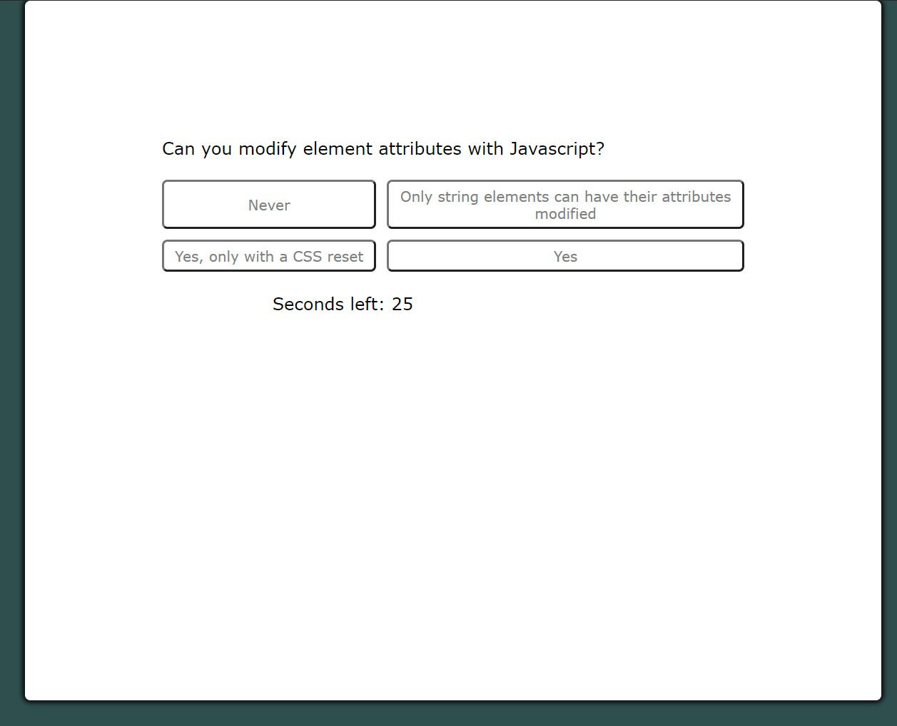

# <04-Code-Quiz>

## Description

A Javascript-based quiz that quizzes you on various Javascript and web API topics! You are able to save and submit your score as well as recall past scores.

## Installation & Access

To access the project, visit my [GitHub Pages](https://patrickbrown-io.github.io/js-api-code-quiz/)

## Usage

I am available for content-creation, web-development, brand identity and more. You are welcome to forward this to any member(s) of your organization responsible for hiring outreach.

## Credits

[Patrick Brown](https://github.com/patrickbrown-io)

## Features

Quiz builds and reassembles itself using nothing but vanilla Javascript!
You can save your scores, and see your saved scores.
Timer functionality.

## How to Contribute

Feel free to send additional questions to be added!
